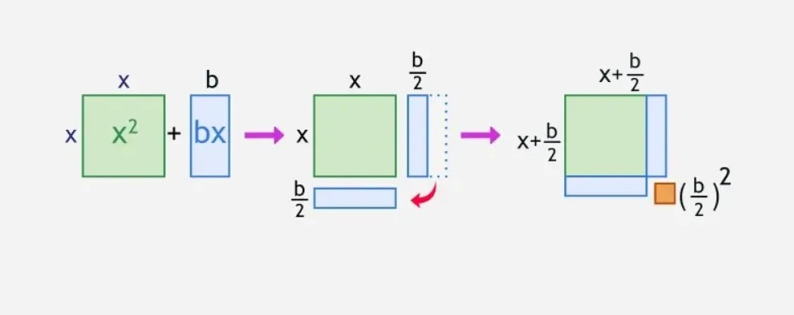

# Introduction and Icebreaker {background-image="image-main.png"}

## Where Have You Seen This Shape? {.scrollable background-image="image-main.png"}

::: {.callout-note .animate__fadeInDown}
## Think about it
Where have you seen a curved, U-shaped arc in real life?

Write down **one example** — anything around you, in sports, nature, or buildings.
:::



## Which of these traces a parabolic arc? {.quiz-question .scrollable background-image="image-main.png"}

- [A thrown basketball]{.correct data-explanation="Yes! Every projectile under gravity follows a parabolic arc — described by a quadratic equation."}
- [A car driving on a flat road]{data-explanation="A flat road is linear — it follows a straight line, not a curve."}
- [The hands of a clock moving]{data-explanation="Clock hands move in a circle, not a parabola."}
- [Water flowing through a straight pipe]{data-explanation="Straight-pipe flow is linear. But a water jet arching through the air? That would be parabolic!"}

# Main Idea {.scrollable background-image="image-main.png"}

## What Is a Quadratic Equation? {.scrollable background-image="image-main.png" auto-animate="true"}

::: {.definition-box .animate__fadeInDown}
A **quadratic equation** is any equation that can be written in the form:

$$ax^2 + bx + c = 0$$

where $a \neq 0$, and $a$, $b$, $c$ are real numbers.
:::

## Anatomy of a Quadratic {.scrollable background-image="image-main.png" auto-animate="true"}

$$ax^2 + bx + c = 0$$

The equation has three parts:

::: incremental
-  $a$: the **leading coefficient**, attached to $x^2$
-  $b$: the **middle coefficient**, attached to $x$
-  $c$: the **constant term**
::: 

## "Is it Quadratic?" Conversation {.scrollable background-image="image-main.png" auto-animate="true"}

This is my conversation with my previous student by challenging me:

## "Is it Quadratic?" Conversation {.scrollable background-image="image-main.png" auto-animate="true"}

This is my conversation with my previous student by challenging me:

:::: {.chat}
::: {.bubble-left}
Is $x^2 + 5x + 6 = 0$ a quadratic equation?
:::

::: {.fragment .bubble-right}
Yes, it is! We have $a = 1,\ b = 5,\ c = 6$. It fits $ax^2 + bx + c = 0$ perfectly.
:::

::: {.fragment .bubble-left}
What about $3x + 5 = 0$?
:::

::: {.fragment .bubble-right}
No, there's no $x^2$ term. In fact, the highest power is 1, not 2, so it belongs to [linear]{.rn rn-type=underline rn-color="#d42f1f"} equation.
:::

::: {.fragment .bubble-left}
How about $2x^2 - 3x = 0$?
:::

::: {.fragment .bubble-right}
Also, yes. $a = 2,\ b = -3,\ c = 0$.
:::

::: {.fragment .bubble-left}
But how though?
:::

::: {.fragment .bubble-right}
The constant term can BE zero. The rule said $b$ and $c$ can be ANY real number. 
:::

::: {.fragment .bubble-left}
What about $x^3 + x^2 = 0$?
:::

::: {.fragment .bubble-right}
No, the highest power is 3.
:::

::: {.fragment .bubble-right}
That will make it [cubic]{.rn rn-type=underline rn-color="#d42f1f"}, not quadratic.
:::

::: {.fragment .bubble-left}
Can you challenge me instead? 
:::

::: {.fragment .bubble-right}
Gladly!
:::

::: {.fragment .bubble-right}
Is this equation: $\dfrac{1}{x} + 2 = 0$ quadratic? 
:::

::: {.fragment .bubble-left}
I got confused a bit, but I am confident that it's not quadratic. The variable here is in the denominator.
:::

::: {.fragment .bubble-right}
That's right. [Rational]{.rn rn-type=underline rn-color="#d42f1f"} or an [inverse]{.rn rn-type=underline rn-color="#d42f1f"} equation is what we can call it. A quadratic can never have $x$ in the denominator.
:::

::: {.fragment .bubble-left}
Thank you, teacher Josh. This helps me identify expressions now. 
:::

::: {.fragment .bubble-right}
No biggie. I'm glad I can help. 
:::

::::

## Key Rule {background-image="image-main.png"}

Always remember: [**$a$ must never be zero.**]{.rn rn-type=box rn-color="#d42f1f" rn-strokeWidth=2} If it were, the $x^2$ term vanishes and the equation is no longer quadratic.

# Three most known methods for solving quadratic equations {background-image="image-main.png"}

## Method 1: Factoring {.scrollable background-image="image-main.png" transition="fade" transition-speed="fast"}

**Goal:** Rewrite $ax^2 + bx + c$ as a product of two binomials.

**Example:**

$$x^2+5x+6=0$$

::: {.fragment .slideInLeft}
::: {.callout-note title="Step 1"}
Find two numbers that **multiply** to $c = 6$ and **add** to $b = 5$:

$$\text{Factors of 6: } (1,6),\ (2,3) \quad \Rightarrow \quad 2 + 3 = 5$$
:::
:::

::: {.fragment .slideInLeft}
::: {.callout-note title="Step 2"}
Factor the equation:

$$(x + 2)(x + 3) = 0$$
:::
:::

::: {.fragment .slideInLeft}
::: {.callout-note title="Step 3"}
Apply the Zero Product Property:

$$x + 2 = 0 \;\Rightarrow\; x = -2 \qquad x + 3 = 0 \;\Rightarrow\; x = -3$$
:::
:::

::: {.fragment .bounceIn}
::: {.callout-tip title="Solutions:"}
$x = -2$ or $x = -3$
:::
:::

## Factoring Practice {.scrollable background-image="image-main.png" transition="fade" transition-speed="fast"}



Solve by factoring: $\quad 2x^2 - x - 6 = 0$

::: {.fragment .slideInLeft}
::: {.callout-note title="Step 1"}
-  Here, we have $a>1$
-  Multiply $a=2$ to $c=-6$, and we got new $c=-12$. 
-  Find two numbers that **multiply** to $-12$ and **add** to $-1$.

We have: $3$ and $-4$

$$\Rightarrow (3) \times (-4) = 12 \quad \text{and} \quad (3) + (-4) = -1 \checkmark$$
:::
:::

::: {.fragment .slideInLeft}
::: {.callout-note title="Step 2"}
Divide those 2 factors into $a=2$, then factor:

Factor:

$$(x + \frac{3}{2})(x - 2) = 0$$

If there's a fraction in either or both binomials, you multiply that binomial with its denominator:

$$(2x + 3)(x - 4) = 0$$

but we're solving the equation, so this is not necessary unless being asked to.

:::
:::

::: {.fragment .slideInLeft}
::: {.callout-note title="Step 3"}
Apply the Zero Product Property:

$$x + \frac{3}{2} = 0 \;\Rightarrow\; x = -\frac{3}{2} \qquad x - 2 = 0 \;\Rightarrow\; x = 2$$
:::
:::

::: {.fragment .bounceIn}
::: {.callout-tip title="Solutions:"}
$\boxed{x = -\frac{3}{2} \quad \text{or} \quad x = 2}$
:::
:::

## Method 2: Quadratic Formula {.scrollable background-image="image-main.png"}

When factoring is difficult, use the **Quadratic Formula**:

::: {.formula-highlight .animate__zoomIn}
$$x = \frac{-b \pm \sqrt{b^2 - 4ac}}{2a}$$
:::

::: {.animate__fadeInUp}
This formula works for **every** quadratic equation.
:::

::: {.callout-note .animate__fadeInUp}
## Memory Tip
*"Negative b, plus or minus square root, b squared minus 4ac, all over 2a!"*
:::

## Quadratic Formula — Worked Example {.scrollable background-image="image-main.png"}

Solve $2x^2 - x - 6 = 0$

::: columns
::: {.column width="50%"}
::: {.fragment .slideInLeft}
::: {.callout-note title="Identify"}
$\quad a = 2,\quad b = -1,\quad c = -6$
:::
:::

::: {.fragment .slideInLeft}
::: {.callout-note title="Substitute"}
$$x = \frac{-(-1) \pm \sqrt{(-1)^2 - 4(2)(-6)}}{2(2)} = \frac{1 \pm \sqrt{49}}{4} = \frac{1 \pm 7}{4}$$
:::
:::
:::

::: {.column width="50%"}
::: {.fragment .slideInRight}
::: {.callout-note title="Solving..."}

$$x = \frac{1 + 7}{4} = \frac{8}{4} = 2 \qquad x = \frac{1 - 7}{4} = -\frac{6}{4} = -\frac{3}{2}$$
:::
:::

::: {.fragment .bounceIn}
::: {.callout-tip title="Solutions"}
$$\boxed{x = 2 \quad \text{or} \quad x = -\frac{3}{2}}$$
:::
:::
:::
:::

## The Discriminant {.scrollable background-image="image-main.png"}

The part $b^2 - 4ac$ is the [**discriminant**]{.rn rn-type=box rn-color="#0088aa"} $(\Delta)$. It helps us predict how many solutions exist.

::: columns
::: {.column width="33%"}
::: {.fragment .zoomIn .disc-box .two-solutions}
### $\Delta > 0$
**Two real solutions**

The parabola crosses the x-axis **twice**.
:::
:::
::: {.column width="33%"}
::: {.fragment .zoomIn .disc-box .one-solution}
### $\Delta = 0$
**One real solution**

The parabola **tangents** (touches once) the x-axis.
:::
:::
::: {.column width="33%"}
::: {.fragment .zoomIn .disc-box .no-solutions}
### $\Delta < 0$
**No real solutions**

The parabola **DOES NOT** cross the x-axis.
:::
:::
:::

## Method 3: Completing the Square {.scrollable background-image="image-main.png"}

The idea here is literally "complete the square" for each sides of the equations. 



> Source: https://media.geeksforgeeks.org/wp-content/uploads/20250214124516755151/Completing-the-square-Method.webp

## Completing the Square: The demo

Transform $x^2 + 6x + 5 = 0$ into the form $(x + h)^2 = k$.

::: {.fragment .slideInLeft}
::: {.callout-note title="Step 1"}
Move the constant:  
$$\quad x^2 + 6x = -5$$
:::
:::

::: {.fragment .slideInLeft}
::: {.callout-note title="Step 2"}
Add $\left(\dfrac{6}{2}\right)^2 = 9$ both sides: 
$$\quad x^2 + 6x + 9 = -5+9 \Rightarrow x^2 + 6x + 9=4$$
:::
:::

::: {.fragment .slideInLeft}
::: {.callout-note title="Step 3"}
Simplify the perfect square trinomial into squared binomial factor: 
$$(x + 3)^2 = 4$$
:::
:::

::: {.fragment .slideInLeft}
::: {.callout-note title="Step 4"}
Take square roots both sides: $\quad x + 3 = \pm 2$
:::
:::

::: {.fragment .slideInLeft}
::: {.callout-note title="Step 5"}
Now solve for each signs: 
$$x + 3 = - 2 \Rightarrow x=-2-3=-5 \quad x+3=2 \Rightarrow x=2-3=-1$$
:::
:::

::: {.fragment .bounceIn}
::: {.callout-tip title="Solutions:"}
$\boxed{x = -5 \quad \text{or} \quad x = -1}$
:::
:::

## Parabola: The visual {.scrollable background-image="image-main.png"}

The graph of $y = ax^2 + bx + c$ is always a **parabola**.

::: columns
::: {.column width="50%"}

| Feature | Formula |
|---------|---------|
| **Vertex** | $x = -\dfrac{b}{2a}$ |
| **Axis of Symmetry** | $x = -\dfrac{b}{2a}$ |
| **Opens Up** | when $a > 0$ |
| **Opens Down** | when $a < 0$ |
| **y-intercept** | $(0, c)$ |
| **x-intercepts** | solutions of the equation |

:::
::: {.column width="50%"}

```{r}
#| echo: false
#| message: false
#| warning: false
#| fig-width: 5.5
#| fig-height: 5

box::use(
    ggplot2[...],
    ggiraph[...]
)

x_range = seq(-0.5, 4.5, length.out = 300)
df_curve = data.frame(x = x_range, y = x_range^2 - 4 * x_range + 3)

df_points = data.frame(
    x = c(2, 1, 3, 0),
    y = c(-1, 0, 0, 3),
    label = c("Vertex", "x-intercept", "x-intercept", "y-intercept"),
    tooltip = c(
        "Vertex: (2, \u22121)\nAxis of symmetry: x = 2",
        "x-intercept: (1, 0)",
        "x-intercept: (3, 0)",
        "y-intercept: (0, 3)"
    ),
    color = c("#d42f1f", "#0088aa", "#0088aa", "#2e9e5b")
)

p = ggplot() +
    geom_vline(
        xintercept = 2, linetype = "dashed",
        color = "#d42f1f", linewidth = 0.6, alpha = 0.6
    ) +
    geom_line(
        data = df_curve, aes(x = x, y = y),
        color = "#1A2A4F", linewidth = 1.2
    ) +
    geom_point_interactive(
        data = df_points,
        aes(x = x, y = y, tooltip = tooltip, data_id = label),
        color = df_points$color, size = 4, shape = 21,
        fill = df_points$color, alpha = 0.85
    ) +
    geom_text(
        data = df_points,
        aes(x = x, y = y, label = label),
        nudge_y = 0.35, size = 3.2,
        color = df_points$color, fontface = "bold"
    ) +
    annotate(
        "text", x = 2.08, y = 4.2, label = "x = 2",
        color = "#d42f1f", size = 3.2, hjust = 0, fontface = "italic"
    ) +
    geom_hline(yintercept = 0, color = "#aaaaaa", linewidth = 0.4) +
    geom_vline(xintercept = 0, color = "#aaaaaa", linewidth = 0.4) +
    scale_x_continuous(breaks = -1:5) +
    scale_y_continuous(breaks = -2:6) +
    coord_cartesian(xlim = c(-0.5, 4.5), ylim = c(-1.8, 5)) +
    labs(
        title = expression(y == x^2 - 4*x + 3),
        x = NULL, y = NULL
    ) +
    theme_minimal(base_size = 12) +
    theme(
        plot.background  = element_rect(fill = "transparent", color = NA),
        panel.background = element_rect(fill = "transparent", color = NA),
        panel.grid.major = element_line(color = "#e0e0e0", linewidth = 0.4),
        panel.grid.minor = element_blank(),
        plot.title       = element_text(
            color = "#1A2A4F", face = "bold", hjust = 0.5, size = 13
        )
    )

girafe(
    ggobj = p,
    width_svg = 5.5, height_svg = 5,
    options = list(
        opts_hover(css = "fill-opacity:1; r:6px;"),
        opts_tooltip(
            css = "background:#1A2A4F; color:white; padding:6px 10px;
             border-radius:6px; font-size:12px; font-family:monospace;",
            use_fill = FALSE
        ),
        opts_sizing(rescale = TRUE),
        opts_toolbar(saveaspng = FALSE)
    )
)
```

:::
:::

## Special Cases {.scrollable background-image="image-main.png"}

There are at least 2 special cases of quadratic equations that can be easily solved.

Suppose $n$ is any real number. 

:::: {.fragment .slideInLeft}
::: {.callout-note title="Perfect Squares"}
When you detected this type of equation:

$$x^2\pm2nx+n^2=0$$

It is tangential to the x-axis, and you'll get 2 kinds of solution:

1. $x= -n$ when $b=2n$ is positive
2. $x= n$ when $b=2n$ is negative

:::
::::

:::: {.fragment .slideInLeft}
::: {.callout-note title="Difference of squares"}
This has to be the easiest quadratic equation to solve

When you have this given:

$$x^2-n^2=0$$

You can just bring $a^2$ to the right side, and you'll get 2 solutions.

$$x= \pm n$$

:::
::::

## Which Method to Use? {.scrollable background-image="image-main.png"}

::: {.method-table .animate__fadeInDown}
| Situation | Best Method |
|-----------|-------------|
| Easy to factor (small integers) | **Factoring** |
| $b = 0$ (e.g. $x^2 - 16 = 0$) | **Square Root** |
| Any quadratic, guaranteed | **Quadratic Formula** |
| Converting to vertex form | **Completing the Square** |
:::
