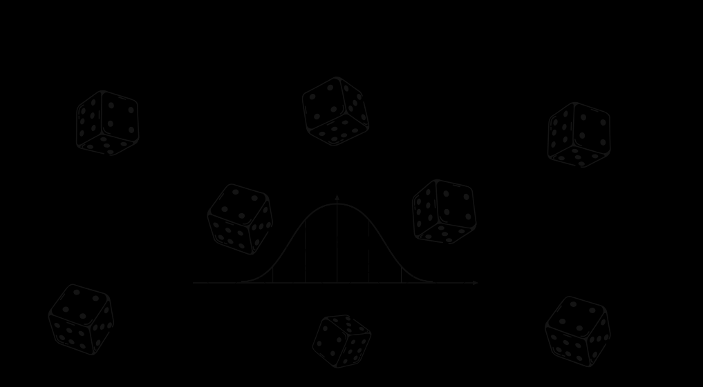

## Recall to standard normal distribution {background-image="image-main.png" auto-animate="true"}

What is a **standard normal distribution**?

## Recall to standard normal distribution {background-image="image-main.png" auto-animate="true"}

What is a **standard normal distribution**?

A special case of the **normal distribution** where:

::: incremental
-   Mean $\mu = 0$
-   Standard deviation $\sigma = 1$
-   Usually a random variable represents as $Z$
:::

## Recall to standard normal distribution {background-image="image-main.png" auto-animate="true"}

Standardize $X$ that scales to standard normal distribution $Z \sim \mathcal{N}(0, 1)$ through **standardization**:

::: {.fragment .fade-in}
$$Z=\frac{X-\mu}{\sigma}$$
:::

::: {.fragment .fade-in}
You'll get *z-scores*
:::

## To calculate probability from the normal distribution {background-image="image-main.png" transition="fade" transition-speed="fast"}

## You need z-table {background-image="image-main.png" transition="fade" transition-speed="fast"}

Go to this link and then download the following PDF.

## You need z-table {background-image="image-main.png" transition="fade" transition-speed="fast"}

Go to this link and then download the following PDF.

Here's what it looks like:

## How to use z-table {background-image="image-main.png" transition="fade" transition-speed="fast"}

## Basics of calculation {background-image="image-main.png" transition="fade" transition-speed="fast"}

